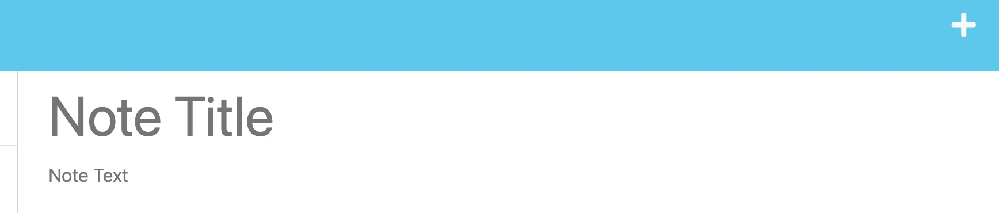

# Note Taker
A note taker that can be used to write and save notes. This application will use an Express.js back end and will save and retrieve note data from a JSON file.

## Project Description
* This application will allow users to create and save notes.
* This application will allow users to view previously saved notes.
* This application will allow users to delete previously saved notes.
* Website live at following url:

## Visuals
* When taken to the landing page the user will be presented with this page:

* When the user clicks on the "Get Started" button they will be taken to the notes page:

* When the user clicks on the plus icon in the top right corner they will be able to enter a new note:

* When the user clicks on the save icon in the top right corner they will be able to save the note:

* When the user clicks on the trash can icon next to the note they will be able to delete the note:

* When the user clicks on the note they will be able to view the note:


## Installation
* Node version 16 is required to run this application
* To install Nodes required packages use the following commands 
```
npm init -y
npm install express
npm install uuid
```
* Clone repository using GitHub
``` 
git clone https://github.com/jkrieger6/note-taker.git
```
* Made using the latest versions of Visual Studio Code
* Made with the latest version of GitHub
* Made using the latest version of Node.js
* Made using the latest version of Express.js
* Made using the latest version of Insomnia Core

## Usage
* To use this application, clone the repository to your local machine and run the following command(s) in your terminal:
```
npm start or node server.js
```


## License
* This application is covered under the [MIT](https://choosealicense.com/licenses/mit/) license
* [](https://opensource.org/licenses/MIT)

## Contributing
1. Fork the repository and clone it to your local machine.
2. Create a new branch for your feature or bug fix.
3. Make your changes and commit them to your branch.
4. Push your changes to your forked repository.
5. Open a pull request to the original repository, and describe your changes and why they are necessary.


## Support
* For support, the best form of contact will be by email at jkrieger11@gmail.com .

## Roadmap
* There are currently no future plans for this application. 
## Authors and acknowledgment
* Jake Krieger
[GitHub](https://github.com/jkrieger6?tab=repositories "GitHub Repos")


